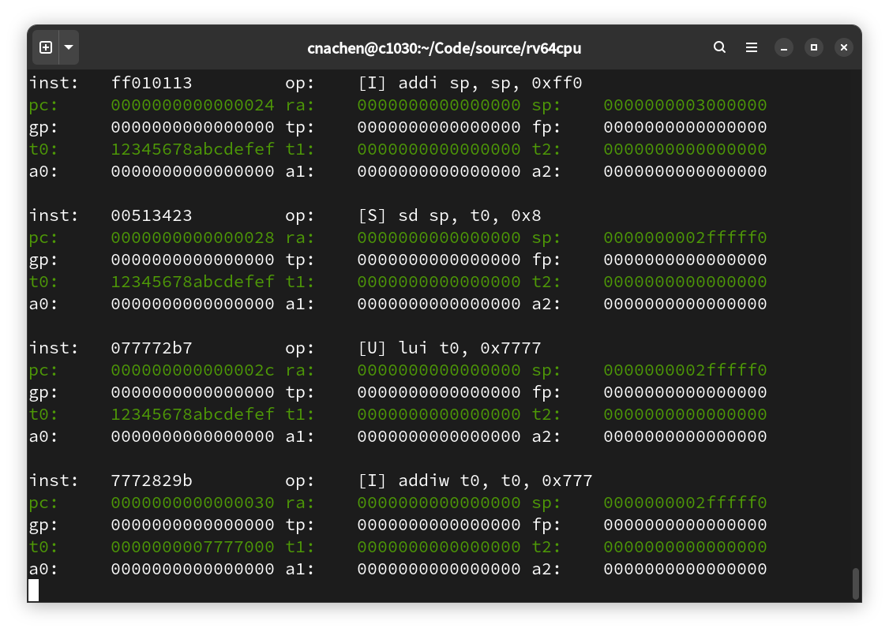

# rv64cpu
An ISA simulator for 64-bit RISC-V.



Support bare metal C, see `./payload`.

To build core, supported ISA extensions and payload, apply
```
make
```

To disassemble payload, apply
```
make -C payload dump
```
